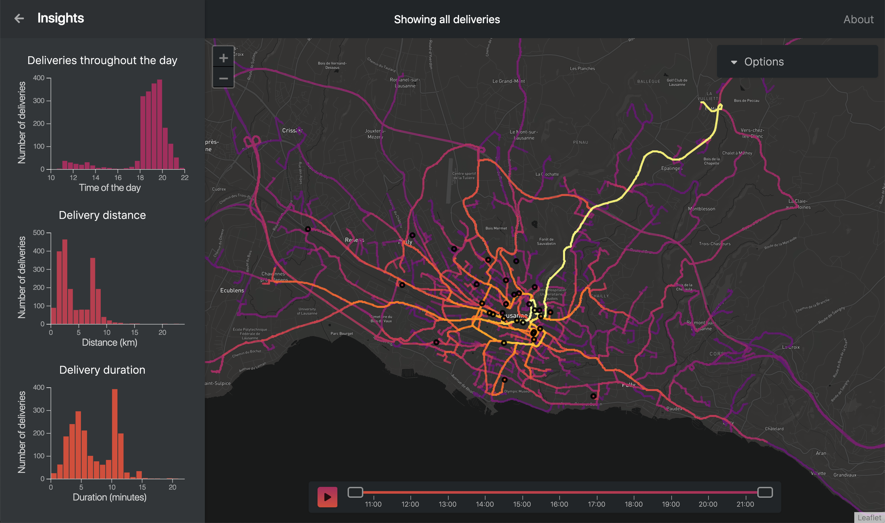

# Colorful Traces
*Project of the course Data Visualization at EPFL, Fall 2018*

Davide Di Dio, Tanguy Albrici, Fatine Benhsain

### [Final Data Viz](https://tgyal.github.io/dataviz-smood)

### [Process Book](#)

### [Screencast](https://youtu.be/Hjjo-Y97D4w)

## About the visualization

This visualization is based on data aquired from Smood, a food delivery company based in Switzerland. Its aim is is to gain insights into the deliveries made in the Lausanne area. For this purpose, we display a heatmap showing the number of deliveries passing through each road is represented. To gain more specific insights, one can select deliveries by time, by restaurant or by road. 

